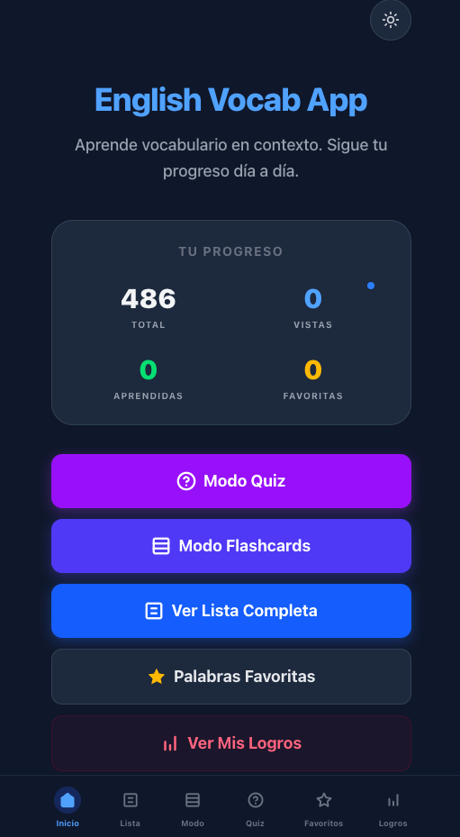
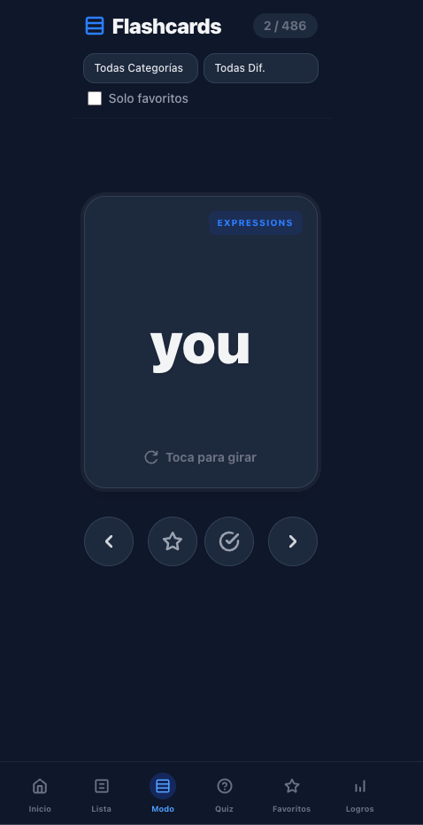
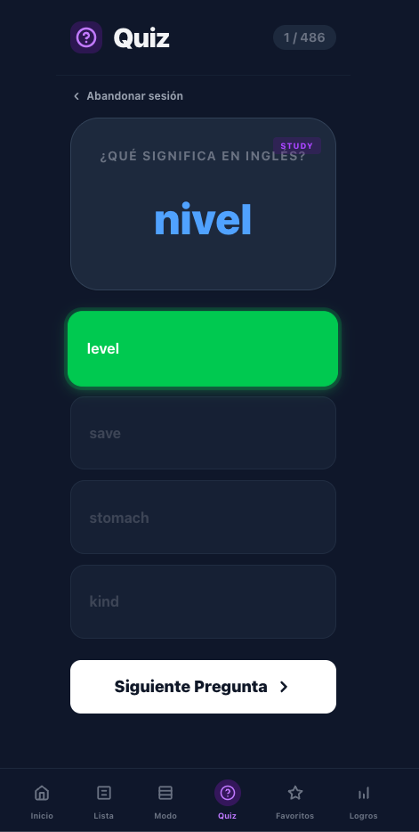
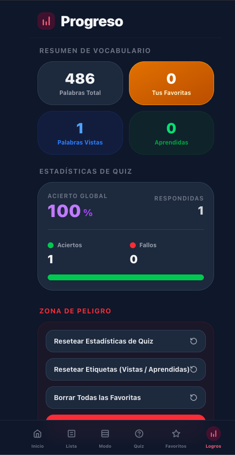

# Thinklingo


Thinklingo es una **web-app de vocabulario inglés–español** pensada para hispanohablantes que quieren mejorar su inglés de forma práctica, visual y natural.

La aplicación permite estudiar vocabulario, consultar ejemplos reales de uso, practicar con **flashcards**, hacer **quizzes**, guardar **favoritos** y seguir el **progreso** del aprendizaje, todo ello en una interfaz limpia, rápida y optimizada para móvil.

---

> `https://thinklingo.vercel.app`

---

## Vista general

Thinklingo nace como una app de estudio enfocada en una necesidad muy concreta: **ayudar a pensar y practicar en inglés con apoyo en español**, sin complicar la experiencia con cuentas, backend o configuraciones innecesarias.

En esta primera versión, todo funciona de forma local en el navegador usando `localStorage`, lo que hace que la app sea rápida, sencilla de usar y fácil de desplegar.

---

## Características principales

- Listado completo de vocabulario inglés–español
- Búsqueda por palabra, traducción o ejemplo
- Filtros por categoría y dificultad
- Vista de detalle por palabra o expresión
- Flashcards interactivas
- Quiz de opción múltiple
- Favoritos
- Seguimiento de progreso
- Modo oscuro
- Diseño mobile-first
- Persistencia local con `localStorage`

---

## Qué puede hacer el usuario

### 1. Explorar vocabulario
El usuario puede navegar por un listado de palabras y expresiones, filtrarlas por categoría o dificultad y acceder al detalle completo de cada entrada.

### 2. Estudiar con flashcards
La app permite practicar el vocabulario mediante tarjetas interactivas, con soporte para palabras largas y expresiones completas.

### 3. Practicar con quiz
El usuario puede responder preguntas tipo test en dos direcciones:
- Inglés → Español
- Español → Inglés

### 4. Guardar progreso
Se pueden marcar palabras como:
- vistas
- aprendidas
- favoritas

### 5. Consultar estadísticas
La app muestra una pantalla de progreso con métricas básicas como:
- total de palabras
- vistas
- aprendidas
- favoritas
- aciertos y fallos en quiz
- porcentaje de acierto

---

## Stack tecnológico

- **Next.js 16**
- **React 19**
- **TypeScript**
- **Tailwind CSS 4**
- **JSON local** como fuente de datos
- **localStorage** para favoritos, progreso, estadísticas y tema
- **Vercel** para despliegue

---

## Estructura de datos

La app utiliza un archivo local:

```bash
data/vocabulary.json
```

Ese archivo contiene **486 entradas** de vocabulario, cada una con la siguiente estructura:

- `id`
- `english_word`
- `spanish_translation`
- `example_sentence_en`
- `example_sentence_es`
- `category`
- `difficulty`
- `tags`
- `note`

---

## Rutas principales

- `/` → Inicio
- `/vocabulario` → Listado de vocabulario
- `/vocabulario/[id]` → Detalle de palabra
- `/flashcards` → Modo tarjetas
- `/quiz` → Quiz
- `/favoritos` → Favoritos
- `/progreso` → Estadísticas y progreso

---

## Capturas

Puedes añadir aquí capturas de pantalla de la app para que el repositorio quede mucho más visual.

### Inicio
`<AÑADE_CAPTURA_HOME>`

### Vocabulario


### Flashcards


### Quiz


### Progreso


---

## Instalación local

Clona el repositorio y entra en la carpeta del proyecto:

```bash
git clone https://github.com/LEMZZOO/thinklingo.git
cd thinklingo
```

Instala dependencias:

```bash
npm install
```

Inicia el entorno de desarrollo:

```bash
npm run dev
```

Abre en el navegador:

```bash
http://localhost:3000
```

---

## Build de producción

```bash
npm run build
npm run start
```

---

## Despliegue

La aplicación está preparada para desplegarse en **Vercel** sin necesidad de backend externo ni variables de entorno obligatorias.

Pasos básicos:

```bash
vercel
vercel --prod
```

---

## Persistencia de datos

Thinklingo no usa base de datos externa en esta versión.

Toda la información del usuario se guarda en el navegador mediante `localStorage`, incluyendo:

- favoritos
- palabras vistas
- palabras aprendidas
- estadísticas del quiz
- preferencia de tema

---

## Decisiones de diseño

Algunas decisiones importantes del proyecto:

- **Sin backend** en esta primera versión, para simplificar despliegue y uso
- **Experiencia mobile-first**, priorizando una navegación cómoda en móvil
- **Modo oscuro** integrado desde el inicio
- **JSON local** como fuente única de verdad para el vocabulario
- **Arquitectura escalable**, preparada para añadir mejoras futuras sin rehacer la base

---

## Próximas mejoras

- repaso espaciado
- más tipos de quiz
- exportar / importar progreso
- audio / pronunciación
- sincronización entre dispositivos
- cuenta de usuario opcional en futuras versiones

---

## Estado del proyecto

Versión inicial funcional completada con:

- navegación principal
- listado de vocabulario
- detalle por entrada
- favoritos
- flashcards
- quiz
- progreso
- dark mode
- despliegue en Vercel

---

## Autor

**Lamine Sane**

Si quieres usar este proyecto como referencia o ver más trabajo mío, puedes enlazar aquí también tu perfil de LinkedIn y tu portfolio.

- LinkedIn: `<https://www.linkedin.com/in/lamine-sane-26b30b214/>`

---

## Licencia

Proyecto de uso personal / portfolio.
